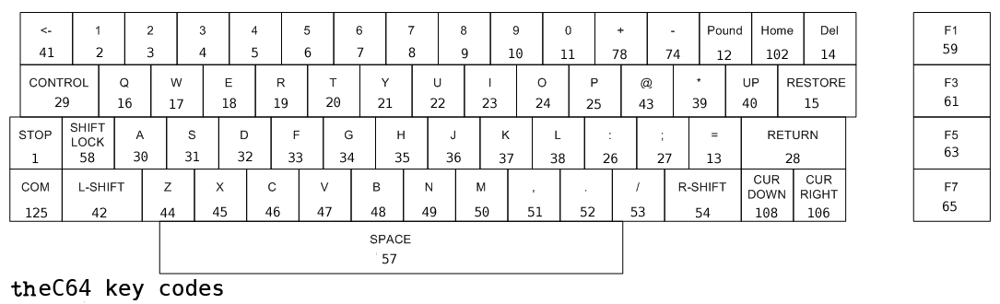

# [theC64 key daemon](https://github.com/podulator/theC64keydaemon)

A lightweight keyboard scanner that runs in the background and controls the volume via combo keys

# Installation

Grab the latest release, unpack it to the root of an sd-card, and do the **Settings -> Information -> Upgrade process**

## How do I use it?

The 2 keys that designate a combo, when pressed together, are
- CTRL
- C64 Key
- 
Then add one of the following
- F1 - Volume up
- F2 - Volume down

## How do I build it?

- Grab a suitable rootfs for the board, eg. [Olimex A20 Lime](http://redirect.viglink.com/?key=71fe2139a887ad501313cd8cce3053c5&subId=6934309&u=https%3A//www.olimex.com/Products/OLinuXino/A20/A20-OLinuXino-LIME/open-source-hardware)
- Make sure you have systemd-nspawn and qemu-user-static installed
- Mount the rootfs image. eg. `mount rootfs.img /mnt`
- Then start a session with : `sudo systemd-nspawn -D /mnt`
- Install build tools etc, and run `./make.sh`

## Key mappings
Key Mappings are based on these key codes

